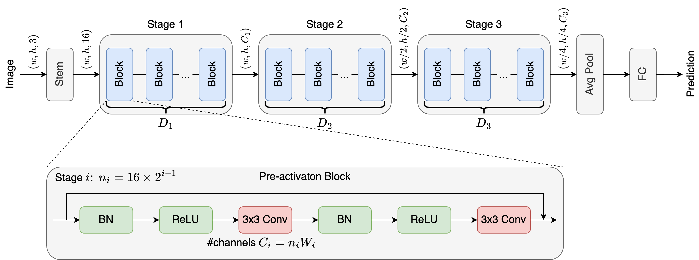

# 🐽 NARes: A Neural Architecture Dataset for Adversarial Robustness on WideResNet

## Search Space Overview



Note:

* Decision Vector: $[D_1, W_1, D_2, W_2, D_3, W_3]$, where $D_{i\in\{1,2,3\}} \in \{4,5,7,9,11\}$ and $W_{i\in\{1,2,3\}} \in \{8,10,12,14,16\}$.

* Total Architectures: $5^6=15625$.

* Each architecture has an arch_id for identification, set from 1 to 15625 by the ascending order of \#MACs.

## Preparation

1. Install packages: `pip install -r requirements.txt`

2. Download and put `cifar10.jsonl` to path `data/`.

## Benchmark

```bash
# Support hydra syntax

# Run the NAS algorithms with seeds from 0 to 199
python nas_benchmark.py -m algo=random_search,local_search,regularized_evolution seed="range(400)"
python nas_benchmark.py -m algo=bananas seed="range(400)"
```

NAS Benchmark Results: (Objective: VAL_PGD_ACC, Runs: 400)

| Accuracy        | Optimal | Random Search  | Local Search | RE             | BANANAS        |
| --------------- | ------- | -------------- | ------------ | -------------- | -------------- |
| Val Clean       | 78.25   | 75.88±0.56     | 75.84±0.59   | 76.07±0.39     | **76.10±0.38** |
| Val PGD (obj)   | 38.80   | 38.18±0.22     | 38.17±0.22   | 38.50±0.24     | **38.55±0.24** |
| Val PGD-CW      | 37.55   | 36.58±0.38     | 36.60±0.41   | 36.96±0.42     | **36.99±0.40** |
| Test Clean      | 88.57   | **87.28±0.37** | 87.26±0.39   | 87.24±0.30     | 87.22±0.28     |
| Test FGSM       | 62.68   | 61.38±0.34     | 61.39±0.36   | **61.46±0.25** | 61.45±0.23     |
| Test PGD        | 57.39   | 56.44±0.36     | 56.47±0.37   | **56.68±0.29** | **56.68±0.26** |
| Test PGD-CW     | 56.17   | 54.86±0.38     | 54.91±0.39   | **55.06±0.26** | 55.05±0.24     |
| Test AA         | 53.48   | 52.18±0.39     | 52.24±0.39   | **52.45±0.28** | **52.45±0.25** |
| Test Corruption | 80.22   | 78.89±0.36     | 78.90±0.36   | 78.90±0.24     | **78.91±0.22** |

## Access the dataset

```python
from dataset import NASBenchR_CIFAR10_Dataset, Metric
from search_space import Arch

dataset = NASBenchR_CIFAR10_Dataset("data/cifar10.jsonl")

wrn_34_10 = Arch(
    depth1=5, depth2=5, depth3=5,
    width1=10, width2=10, width3=10,
)

wrn_70_16 = Arch(
    depth1=11, depth2=11, depth3=11,
    width1=16, width2=16, width3=16,
)

# get a single record
record = dataset.query(wrn_34_10)

# get multiple records at once (return a generator)
for record in dataset.batch_query([wrn_34_10, wrn_70_16]):
    ...
```

# Acknowledgement

* [naszilla](https://github.com/naszilla/naszilla)

* [RobustWRN](https://github.com/HanxunH/RobustWRN)

* [torchattacks](https://github.com/Harry24k/adversarial-attacks-pytorch)

* [auto-attack](https://github.com/fra31/auto-attack)